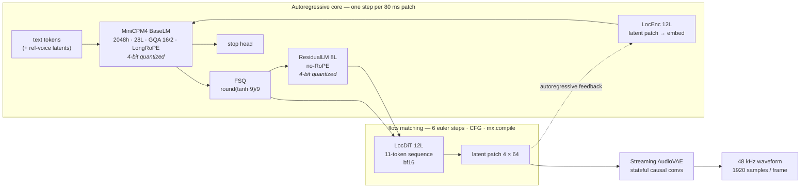
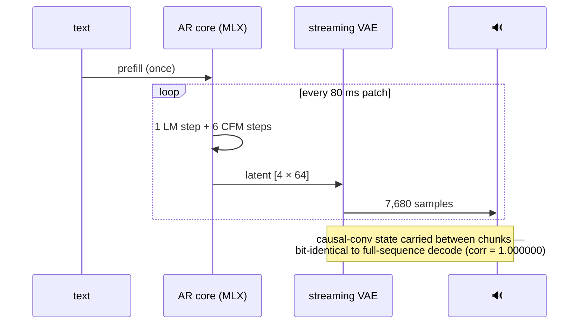

# VoxCPM2.0.mlx

**[VoxCPM2](https://github.com/OpenBMB/VoxCPM) (2B, tokenizer-free TTS, 30 languages) running natively on Apple Silicon via [MLX](https://github.com/ml-explore/mlx).**

Zero weight conversion for the LM (577 tensors load by name), bit-exact AudioVAE, stateful streaming decode, 4-bit quantization. Verified module-by-module against the official PyTorch implementation.

```
pip install mlx transformers  →  first audio in ~320 ms
```

---

## Architecture



## Streaming pipeline



## Performance (M2 · 16 GB)

| optimization step | RTF ↓ |
|---|---|
| naive port (bf16, per-patch VAE) | 7.7 |
| full-sequence VAE decode | 3.4 |
| `mx.compile` DiT + 4-bit LM | 2.2 |
| CFM timesteps 10 → 6 | **1.35** |
| streaming mode (first audio **323 ms**) | 1.48 |

> M3 Ultra projection: **RTF ≈ 0.2** — real-time simultaneous-interpretation grade.
> Reference points: VoxCPM.cpp ≈ 3.6 (x86 CPU), official PyTorch ≈ 0.17 (RTX 4090).

## Correctness — verified, not vibes

| module | vs official PyTorch | result |
|---|---|---|
| tokenizer (Llama + CJK char-split) | token-exact | ✅ |
| LocEnc / BaseLM / FSQ / ResidualLM / LocDiT / stop head | 8/8 golden tensors | ✅ corr = 1.000000 |
| AudioVAE decoder | fixed-latent golden | ✅ max diff 4.6e-7 |
| AudioVAE encoder (voice cloning) | fixed-wav golden | ✅ max diff 0.0000 |
| streaming vs full decode | same latents | ✅ corr = 1.000000 |
| end-to-end (zh + lo) | ASR round-trip | ✅ verbatim |

## Quick start

```python
from voxcpm2_mlx import VoxCPM2Pipeline

pipe = VoxCPM2Pipeline("path/to/VoxCPM2", inference_timesteps=6, quantize_lm=4)

# streaming synthesis
for chunk, i in pipe.generate_streaming("你好，欢迎使用语音合成服务。"):
    play(chunk)                      # float32 @ 48 kHz, ~320 ms to first chunk

# voice cloning (5 s reference is enough)
ref = pipe.encode_reference(ref_wav_16k)
wav, stats = pipe.generate("ສະບາຍດີທຸກໆທ່ານ", ref_latents=ref)
```

One-time VAE conversion (`audiovae.pth` → MLX layout, LM needs none):

```bash
python scripts/convert_vae.py path/to/VoxCPM2
```

## Samples

`samples/` — zero-shot zh / lo synthesis, ASR-round-trip verified.

## Credits

- [OpenBMB/VoxCPM](https://github.com/OpenBMB/VoxCPM) — model & official implementation (Apache-2.0)
- [ml-explore/mlx](https://github.com/ml-explore/mlx) — the array framework that made this a one-day port
